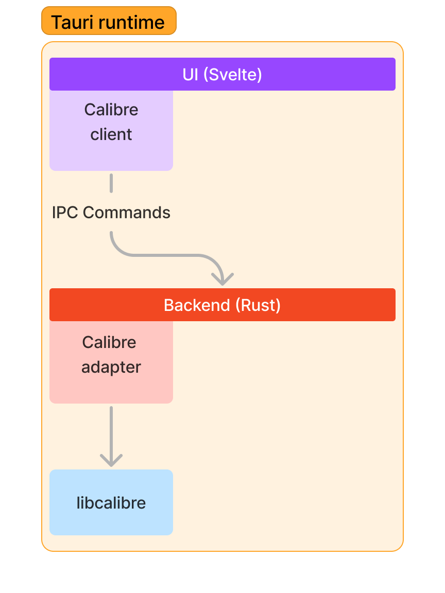

# Citadel docs

Citadel is a Tauri app that uses React for the UI and Rust for the backend.

Tauri uses native WebViews to render the UI, which is why the app is so small.
It also means that not all users will see the same UI, as it depends on the
browser engine installed on the user's system.

## 📚 Architecture Documentation

**New architectural recommendations and analysis:**

- **[Architecture Recommendations](../ai-docs/ARCHITECTURE_RECOMMENDATIONS.md)** - Detailed recommendations for Svelte-inspired React + Tauri/remote architecture
- **[Migration Example](../ai-docs/MIGRATION_EXAMPLE.md)** - Step-by-step guide for migrating the books feature to the new architecture
- **[Patterns Quick Reference](../ai-docs/PATTERNS_QUICK_REFERENCE.md)** - Cheat sheet of common patterns and best practices

**Start here if you're:**
- 🚀 **New to the project**: Read the Overview below, then [Architecture Recommendations](../ai-docs/ARCHITECTURE_RECOMMENDATIONS.md)
- 🔧 **Adding a feature**: Check [Patterns Quick Reference](../ai-docs/PATTERNS_QUICK_REFERENCE.md)
- 🏗️ **Planning refactoring**: Review [Architecture Analysis](../ai-docs/ARCHITECTURE_ANALYSIS.md) and [Migration Example](./MIGRATION_EXAMPLE.md)

## Overview

There are two ways to use Citadel: bundled in one app or as a headless server & web app.
The headless server is still in progress, so we'll focus on the bundled app.

<figure>
  Overview of how the UI talks to <code>libcalibre</code>.</figcaption>
</figure>

The bundled app has a React frontend that uses interprocess communication (IPC) to send async commands to the backend.
The frontend has a `Library` that can be initialized to use different kind of library types.
For now, the only option is either local or remote Calibre libraries.

All reading, creating, and updating is done by the `libcalibre` crate.
Citadel is essentially a UI wrapper around that library.

## Principles

As little business logic is written in the front end as possible, excluding UI logic.

Where possible, we look to composability and modularity.
All logic related to Calibre, for instance, is in a `libcalibre` crate that can be used in other projects.

Modules are deep, and errors are defined out of existence. For more, see
[A Philosophy of Software Design](https://openlibrary.org/books/OL28736729M/A_Philosophy_of_Software_Design).

### Evolving Principles (2025)

The architecture is evolving toward a **store-based pattern** that:
- Uses Svelte stores as single source of truth
- Provides automatic UI updates via subscriptions
- Implements a thin adapter layer for Tauri/remote differences
- Optimizes for development velocity while supporting both local and remote modes

See [Architecture Recommendations](../ai-docs/ARCHITECTURE_RECOMMENDATIONS.md) for details on this approach.
